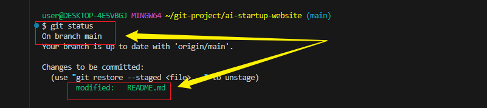

# ai-startup-website
This is my first repository as a DevOp Engineer
```
In this project, I developed a startup website as part of my practical learning exercise. During the process, I also created and worked with two separate branches to simulate a real-world collaborative development workflow. This involved running and practicing several basic Git commands to manage version control effectively.

To provide clarity on the steps I carried out, I have included snapshots of each command executed in the terminal, demonstrating how the branches were created, switched, updated, and eventually merged back into the project workflow.
```
## mkdir 
At this stage, I created a new repository directory by using the mkdir command in the terminal. This command established a dedicated folder that will serve as the storage space for all the files and resources related to my project.

Once the folder was created, I then used the cd (change directory) command to navigate into the newly created repository directory. This ensured that all subsequent commands would be executed within the correct project location.

After navigating into the directory, I proceeded to initialize the repository by running the git init command. This step set up the necessary Git structure within the folder, enabling version control and allowing me to begin tracking changes, creating branches, and managing the project effectively.


## git clone command
In this step, I cloned the repository from my GitHub account using the git clone command. This action created a local copy of the remote repository on my system, ensuring that all files, version history, and configurations from GitHub were successfully downloaded and stored within my local environment.

Once the repository was cloned, I then used the cd (change directory) command to navigate into the cloned repository folder. This placed me inside the working directory of the project, allowing me to perform further Git operations such as creating branches, committing changes, and pushing updates back to GitHub.


## touch
In this step, I used the touch command to create a new file named index.html inside the main repository. This file will serve as the foundation for my HTML documentation and the starting point for developing the structure of the project website.

After creating the file, I executed the code . command, which opened the entire repository folder in Visual Studio Code (VS Code). From there, I was able to begin editing and documenting content directly within the index.html file in a structured and user-friendly environment.

Additionally, I used the git status command to check the current state of the repository. This allowed me to verify that the newly created index.html file was recognized by Git as an untracked file, ensuring that I could keep track of its changes and prepare it for staging and committing in the next steps.


## git add command
In this step, I used the git add command to stage the index.html file, preparing it to be saved in the repository. After that, I ran the git status command to confirm that the file was staged successfully. Finally, I used the git commit -m command to save the changes with a message, making the update part of the project’s history.


## git push command
In this step, I used the git push command to upload the updated changes from my local repository to the main repository on GitHub. 


## git checkout -b command
 I used the git checkout -b command to create a new branch and switch into it right away.


## echo & git add command
I used the echo command to write a simple HTML structure into the index.html file. After that, I used the git add command to stage the file.


## git commit -m command
I used the git commit -m command to save my changes with a message in the repository.


## git push origin command
I used the git push origin command to upload my committed changes from the local repository to the remote repository.


## git pull command
I used the git pull command to fetch and download the latest updates from the remote repository and merge them into my local working directory. This ensured that my computer had the most up-to-date version of the project, keeping my local copy synchronized with the changes made by others in the repository.


## git checkout -b command
Here, I used the git checkout -b command to both create and immediately switch into a new branch named add-contact-info. This step allowed me to separate the new changes from the main branch, ensuring that any updates or modifications to the project could be tested and managed safely before merging them back into the main repository.


## echo command
 Here, I used the echo command to write Jerry’s contact information directly into the file. This allowed me to quickly add the required details from the terminal without manually opening the file in a text editor.


## git commit -m command
Firstly, I used the git status command to check the current state of the working directory and see which files had been modified. Secondly, I used the git add command to stage the updated file, preparing it to be included in the next commit. Finally, I used the git commit -m command to save the changes in the local repository along with a descriptive message, creating a record of the update in the project’s history.


## git push origin add-contact-info cammand
In this step, I used the git push command to upload my committed changes from the local repository to the remote repository on GitHub. This ensured that the updated file was successfully transferred and synchronized with the central repository, making it accessible online and up to date with the latest modifications.


## git add README.md command
In this step, I used the git status command to review the current state of my working directory and identified that the README.md file had been modified but not yet saved to the staging area. To prepare the file for committing, I then used the git add README.md command, which successfully staged the updated file and made it ready for the next commit.


## git status command
In this step, I used the git status command to verify the current state of the repository. The output confirmed that the README.md file, which I had previously staged using the git add command, was successfully placed in the staging area. This confirmation ensured that the file was ready to be committed, reflecting the updated changes in the next commit.



## git commit -m command
At this stage, I executed the command git commit -m "update README.md with snapshots" to record the staged changes into the local repository. This commit specifically saved the updates made to the README.md file, with the commit message clearly describing the purpose of the change—adding snapshots. By providing this descriptive message, it ensures that the history of changes in the repository remains clear and easy to understand for future reference.


## git push command
At this point, I used the git push origin main command to upload the most recent version of my work from the local repository to the remote repository on GitHub. This step ensured that the updated copy of the file, along with all committed changes, was successfully transferred to the remote repository. By pushing to the main branch, the remote repository now reflects the latest state of the project, making the updates accessible to all collaborators and maintaining version consistency across environments.

